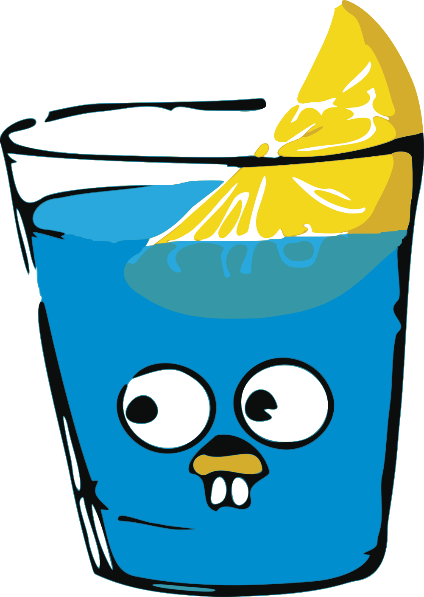

# Action Platform — Templates

Cookiecutter templates for bootstrapping projects on the Action Platform.

**Index:** [`index.json`](index.json) (the catalog, machine-readable) · [Usage](#usage) · [Projects](#projects) · [Clouds](#clouds) · [Services](#services) · [Structure](#structure) · [`index.json`](#indexjson) · [CI](#ci) · [Conventions](#conventions)

## Usage

```bash
pipx install cookiecutter

cookiecutter gh:actionplatform/templates --directory projects/web/python/fastapi
```

Or via the CLI:

```bash
action-platform init                        # interactive: type → stack → template → name
action-platform init web python fastapi     # direct
action-platform init web python             # default template for the stack
action-platform init web python --cloud aws/lambda
action-platform init --list                 # projects and clouds
action-platform cloud set docker            # overlay on an existing project
```

## Projects

Under `projects/`, three levels: **type → stack → template**.

| Type | Language | Framework | Template | Description | Default |
|---|---|---|---|---|:---:|
| `web` |  python |  FastAPI | [`fastapi`](projects/web/python/fastapi) | FastAPI + uvicorn + pydantic | ✓ |
|  |  python |  FastMCP | [`fastmcp`](projects/web/python/fastmcp) | MCP server over HTTP |  |
|  |  go |  Gin | [`gin`](projects/web/go/gin) | Gin + net/http | ✓ |
|  |  node |  React | [`react`](projects/web/node/react) | React + webpack + jest | ✓ |
|  |  node |  Fastify | [`fastify`](projects/web/node/fastify) | Fastify + TypeScript + Vitest |  |
|  |  node |  React + Vite | [`react-vite`](projects/web/node/react-vite) | React + TypeScript + Vite + Vitest |  |
|  |  java |  Spring Boot | [`spring`](projects/web/java/spring) | Spring Boot web API (Maven, JDK 17) | ✓ |
|  |  kotlin |  Spring Boot | [`spring`](projects/web/kotlin/spring) | Spring Boot web API in Kotlin (Maven, JDK 17) | ✓ |
|  |  ruby |  Sinatra | [`sinatra`](projects/web/ruby/sinatra) | Sinatra + Puma + RSpec | ✓ |
| `library` |  python |  Poetry | [`poetry`](projects/library/python/poetry) | Poetry package | ✓ |
|  |  python |  Typer | [`typer`](projects/library/python/typer) | Python CLI with Typer |  |
|  |  go |  Go module | [`module`](projects/library/go/module) | Go module | ✓ |
|  |  go |  Cobra | [`cobra`](projects/library/go/cobra) | Go CLI with Cobra |  |
|  |  node |  npm | [`npm`](projects/library/node/npm) | npm package + TypeScript | ✓ |
|  |  php |  Composer | [`composer`](projects/library/php/composer) | Composer package | ✓ |
|  |  java |  Maven | [`maven`](projects/library/java/maven) | Maven artifact | ✓ |
|  |  rust |  Cargo | [`cargo`](projects/library/rust/cargo) | Cargo crate | ✓ |
| `automation` |  python |  argparse | [`basic`](projects/automation/python/basic) | Simple Python automation: `python -m app` | ✓ |
|  |  python |  argparse | [`scheduled`](projects/automation/python/scheduled) | Scheduled Python jobs: `python -m app run <job>` |  |
| `docs` | mkdocs |  MkDocs Material | [`material`](projects/docs/mkdocs/material) | MkDocs Material site | ✓ |
| `plugin` | chrome |  Manifest V3 | [`vanilla`](projects/plugin/chrome/vanilla) | Chrome extension, no bundler | ✓ |
| `empty` | — | — | [`empty`](projects/empty) | Only `platform.toml` + `.code_quality/` |  |

`action-platform init <type> <stack>` picks the default template of the pair; name the third part to pick another (`init web node fastify`). `plugin` stack is the **host system** — it imposes the language.

## Clouds

Under `cloud/`, deploy overlays applied **on top** of a generated project. Projects stay cloud-agnostic; the overlay adds only deploy files and sets `[deploy] target` in `platform.toml`. The contract every `web` project honours — **serve HTTP on `$PORT`** — is what lets one overlay deploy every language: the build is `ap-build package` (from [images-base](https://github.com/actionplatform/images-base)), no per-language files.

| Cloud | Types | Languages | Adds |
|---|---|---|---|
|  [`aws/amplify`](cloud/aws/amplify) | web | node | `amplify.yml`, `customHttp.yml`, deploy workflow (start job + wait) |
|  [`docker`](cloud/docker) | web | python, node, go, java, kotlin, ruby | `Dockerfile` (build image → runtime image), `docker-compose.yml`, `.dockerignore` |

Clouds that need a deploy target come as plugins and bring their overlay with them: `aws/lambda` lives in [apx-aws-lambda](https://github.com/actionplatform/apx-aws-lambda) and shows in the matrix through the plugin.

AWS overlays ship `requirements/` — `trust.json` (GitHub OIDC for the repo) and `policy.json` (least privilege the deploy role needs). `DEPLOY.md` shows the two `aws iam` commands to create the role.

Convention: every `web/python/*` template exposes `app.create_app()` — the Lambda handler, uvicorn and tests build the app through it. MCP servers are `web` too (`web/python/fastmcp`).

## Services

Under `service/`, application dependencies. Each adds `services/<name>/` to the project with an `up` script (provision), a `link` script (prints env vars) and the provider's files. Pick the provider with `provider=`.

| Service | Providers | Exposes |
|---|---|---|
|  [`postgres`](service/postgres) | docker, aws-rds | `DATABASE_URL` |

```bash
action-platform service add postgres --provider docker
eval "$(./services/postgres/link)"
```

## Structure

```
templates/
├── index.json            the catalog: types, stacks, projects, clouds, services — read by the CLI, the API and the web app
├── projects/             <type>/<stack>/<template> — 22 templates, see the catalog above
├── cloud/                aws/amplify · docker (aws/lambda comes with its plugin)
├── service/              postgres
└── assets/icons/
```

Each leaf is an independent cookiecutter template with its own `cookiecutter.json` and an entry in `index.json`. Select it with `--directory projects/<type>/<stack>/<template>` or `--directory cloud/<name>`.

## `index.json`

The one source of truth for the catalog. Every entry has an `id` that is also its path under `projects/`, `cloud/` or `service/`; icons are paths under `assets/`.

```json
{
  "types":  [{ "id": "web", "label": "Web application", "description": "…" }],
  "stacks": [{ "id": "python", "label": "Python", "icon": "assets/icons/python.svg" }],
  "projects": [
    { "id": "web/python/fastapi", "type": "web", "stack": "python", "template": "fastapi",
      "framework": "FastAPI", "language": "python", "description": "…", "default": true,
      "icons": { "language": "assets/icons/python.svg", "framework": "assets/icons/fastapi.svg" } }
  ],
  "clouds":   [{ "id": "docker", "types": ["web"], "languages": ["python"], "icon": "…", "description": "…" }],
  "services": [{ "id": "postgres", "providers": ["docker", "aws-rds"], "icon": "…", "description": "…" }]
}
```

The CLI reads it from its clone; the API fetches it raw from this repository (`ACTION_PLATFORM_TEMPLATES_INDEX`, refreshed every ten minutes) so a merged template shows up without a redeploy; the web app renders what the API answers. One `default: true` per type and stack.

## CI

Every template (except `empty`) ships config for four CI providers. Pick one with the `ci` variable; the post-gen hook removes the others.

| `ci` | File |
|---|---|
|  `github` | `.github/workflows/code-quality.yml` |
|  `gitlab` | `.gitlab-ci.yml` |
|  `jenkins` | `Jenkinsfile` |
|  `bitbucket` | `bitbucket-pipelines.yml` |

```bash
cookiecutter gh:actionplatform/templates --directory projects/web/python/fastapi ci=gitlab
```

All four call the same scripts from [ci-scripts](https://github.com/actionplatform/ci-scripts) through [ci-github](https://github.com/actionplatform/ci-github) (composite actions), [ci-gitlab](https://github.com/actionplatform/ci-gitlab) (`include: remote`), [ci-jenkins](https://github.com/actionplatform/ci-jenkins) (shared library) and [ci-bitbucket](https://github.com/actionplatform/ci-bitbucket) (a self-contained `bitbucket-pipelines.yml`, since Pipelines cannot include a remote file).

## Validation

`.github/workflows/templates.yml` runs on every pull request: `scripts/render.py` renders every template for each of the four CI providers and fails on an unrendered tag, a CI file left behind or a `LAST_VERSION` other than `0.0.0`; then one job per template runs the same `setup.sh` and `check.sh` from ci-scripts that the generated project's own CI runs — install, lint, format, tests. A template that does not pass its own checks does not merge.

```bash
pip install cookiecutter
python scripts/render.py --ci github out      # every template into out/<id>/sample-app
python scripts/render.py --list               # the matrix
```

## Conventions

- Every template ships `platform.toml` so the project works with `action-platform release` and `deploy` out of the box.
- Every template ships `.code_quality/` with the stack's lint/format config.
- Git-flow and Conventional Commits are enforced by git hooks the CLI installs into `.git/hooks` (`action-platform install`, once per clone; `init`, `branch` and `push` do it too) and by the `gitflow` CI check on pull requests. Hooks are not versioned in the project.
- Each stack has exactly one template with `default = true`.
- Variables are declared in `cookiecutter.json`; keep defaults sensible.
